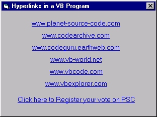



## Hyperlinks:  Add hyperlinks to your VB Programs\!

### Description

Lets you create hyperlinks from within your program, only 2 lines of code and no OCX's! Just follow the simple instructions in the code, Hyperlinks can also be used for Hypergraphics in your program too. Use this in menu controls (for directing your programs end-users to your technical support pages, help pages etc..). loads of possible uses!

The cursor changes into a hand, and using the click event the hyperlink can change color when visited, - Does the same as the real thing!
 
### More Info
 

             |
---                |---
**Submitted On**   |2000-11-12 18:06:00
**By**             |[Jason Bennison](https://github.com/Planet-Source-Code/PSCIndex/blob/master/ByAuthor/jason-bennison.md)
**Level**          |Intermediate
**User Rating**    |4.8 (111 globes from 23 users)
**Compatibility**  |VB 6\.0
**Category**       |[Internet/ HTML](https://github.com/Planet-Source-Code/PSCIndex/blob/master/ByCategory/internet-html__1-34.md)
**World**          |[Visual Basic](https://github.com/Planet-Source-Code/PSCIndex/blob/master/ByWorld/visual-basic.md)
**Archive File**   |[CODE\_UPLOAD1161111122000\.zip](https://github.com/Planet-Source-Code/jason-bennison-hyperlinks-add-hyperlinks-to-your-vb-programs__1-12684/archive/master.zip)

